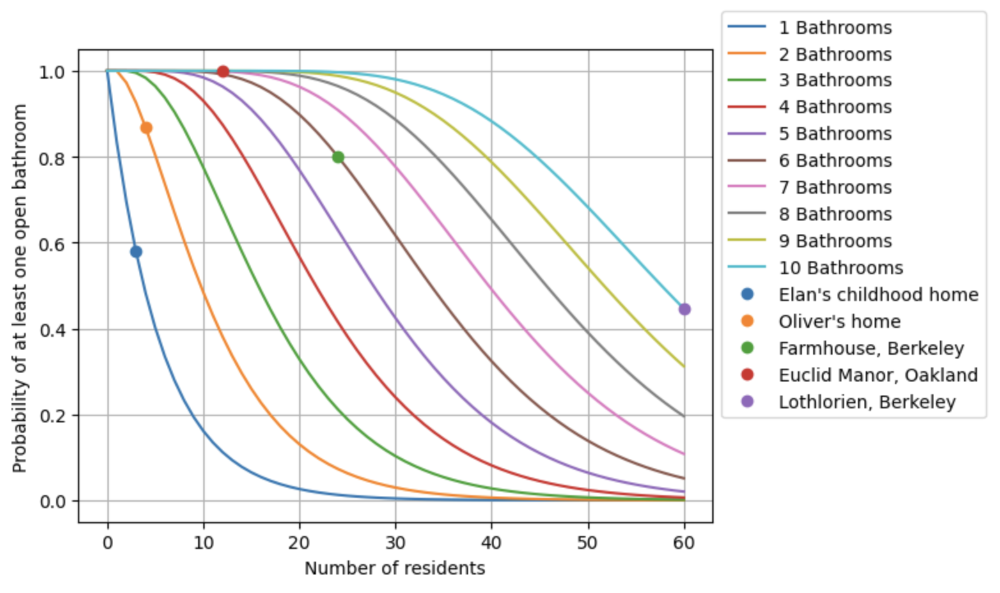

# 🚽🏠 What's the Likelihood at Least One Bathroom Will be Available in Your House?

Growing up in a three-person 1-bathroom household, the potty could sometimes feel like a scarce resource. Whoever needed to go Number 1 always got priority over Number 2...

As a young adult living in 60-person housing cooperatives, I curiously never experienced this issue.

Which got me thinking...

What's the likelihood of at least one bathroom being free as a function of number of people and bathrooms in a house during "rush hour" traffic? 💩🚗 ;)

My mathematician and coding-wizard friend Oliver Evans was game to figure it out with me and this notebook is the result!

Maybe you're even reading it on your phone on the toilet ;)

# 🪠 [Click Here to Plumb The Question!](https://colab.research.google.com/github/elanlavie/CommunalBathrooms/blob/main/Bathrooms.ipynb)

